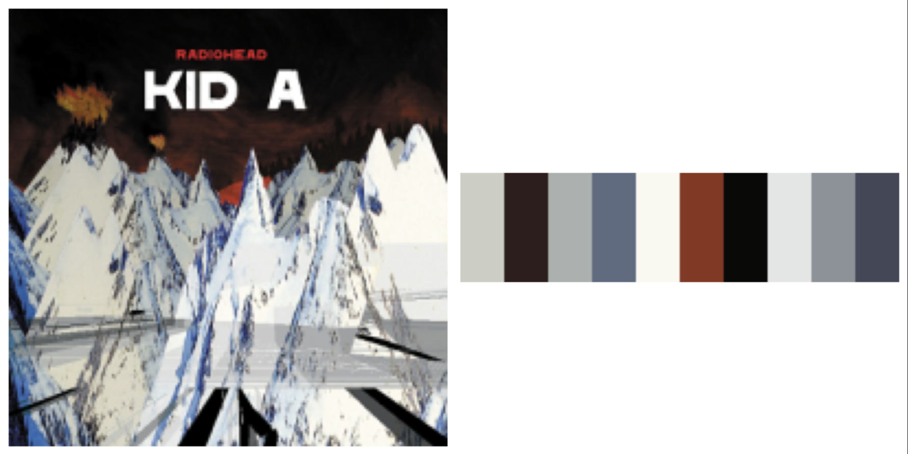
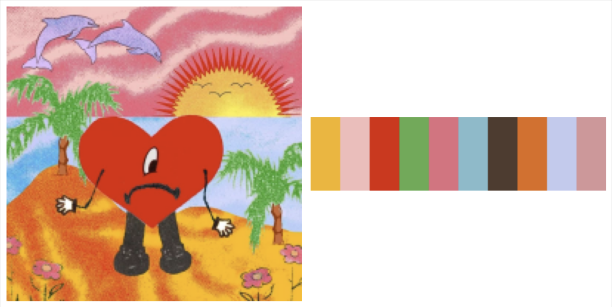
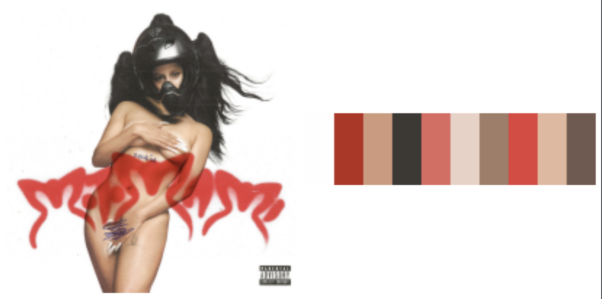
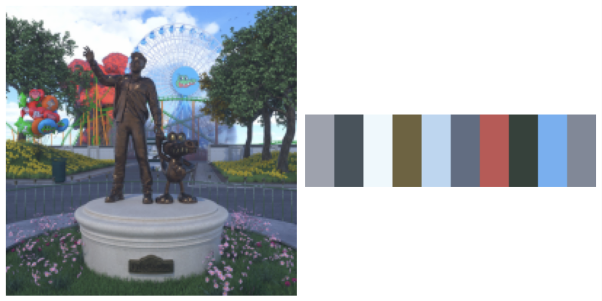
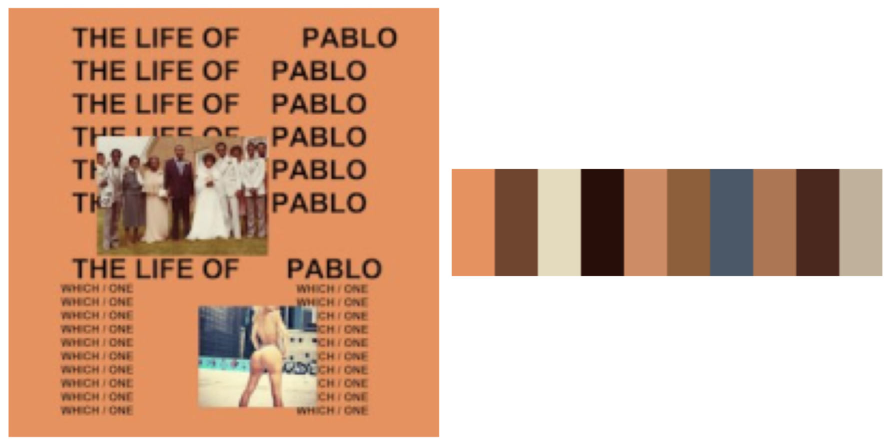
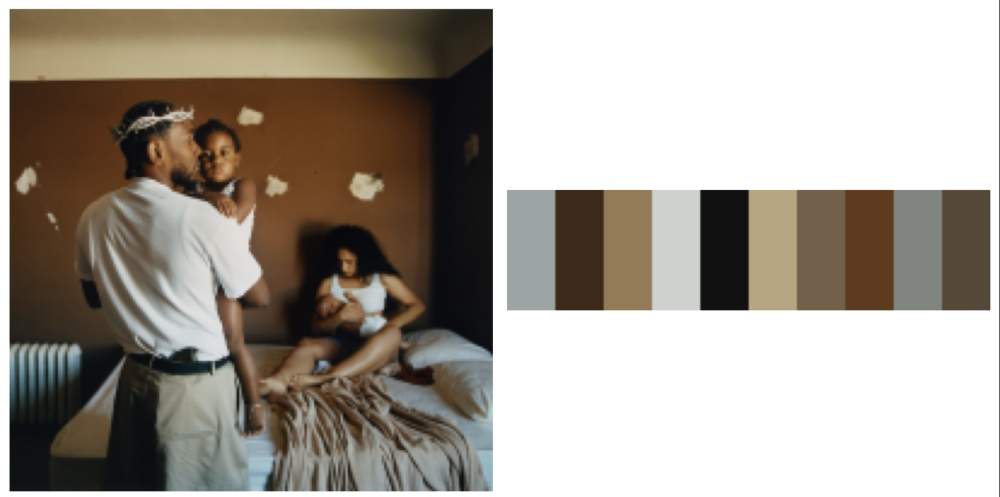
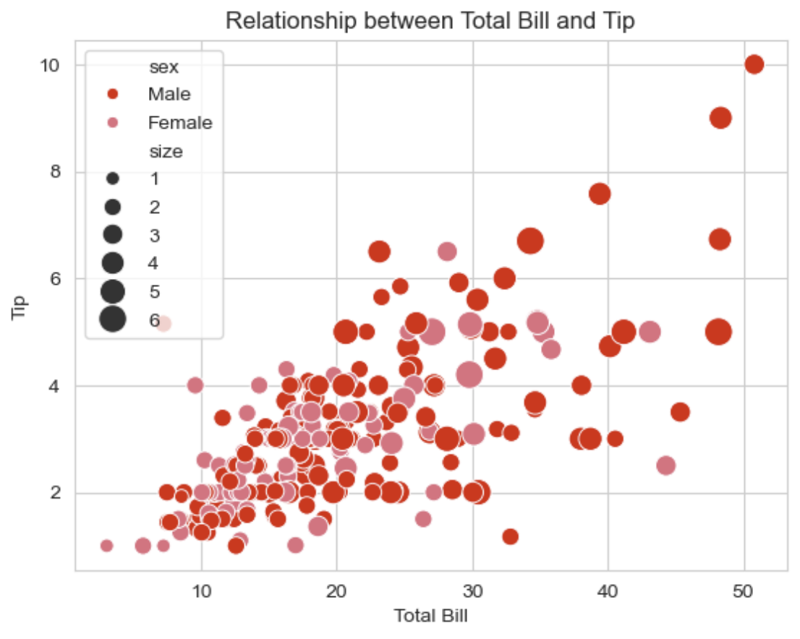
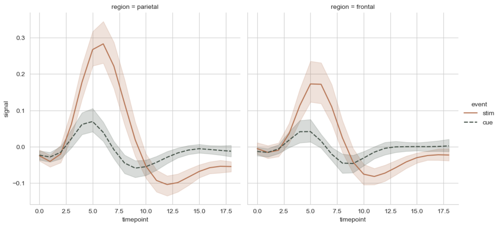
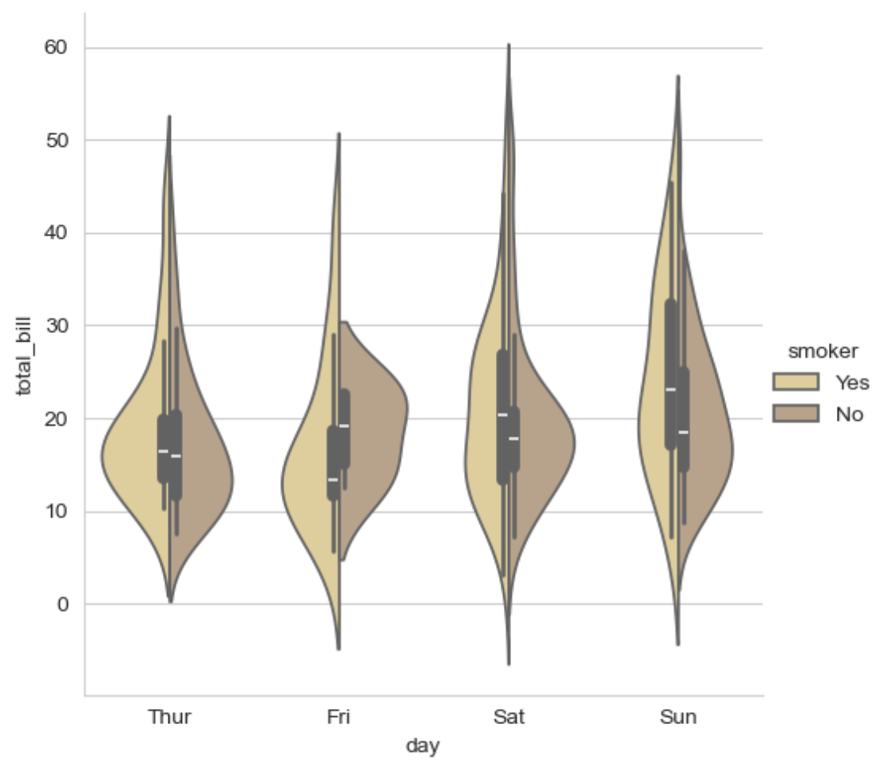
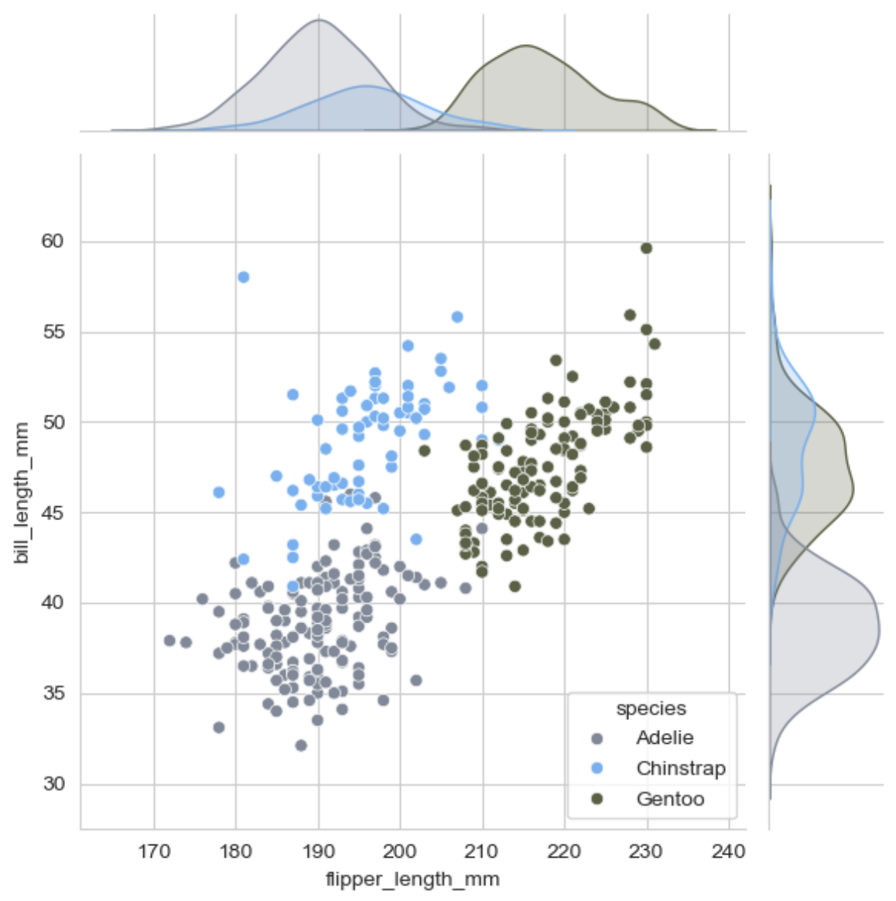

# album_colours

Color your favorite albums into seaborn or matplotlib.

These palettes are the result of employing KMeans clustering on the color data extracted from the album covers.

The album selection for each artist was influenced by the colors of their cover, instead of their quality or representativeness.

Other albums are free to join this package. Open a PR with the album cover and the name of the artist and album.

> Inspiration:
> * https://github.com/karthik/wesanderson
> * https://github.com/jbgb13/peRReo

# Installation

```bash
$ pip install album_colours 
```

# Usage

Use this way into your notebook or script:

```python
from album_colours import palette_generator

palette = palette_generator.color_gradient_generator('<palette>', 2)
```

We currently support the following albums:

* `devendra` [Flying Wig](https://pitchfork.com/reviews/albums/devendra-banhart-flying-wig/) - Devendra Banhart
* `alvaro_diaz` [Felicilandia](https://open.spotify.com/intl-es/album/7jg09IJJXi1eigVLZja2hN) - Álvaro Díaz
* `alvaro_diaz2` [Single Llori Pari](https://open.spotify.com/intl-es/album/4jG7eBaWlLUjRRS1ajTCJ3) - Álvaro Díaz
* `aventura` [The Last](https://en.wikipedia.org/wiki/The_Last_(album)) - Aventura
* `bad_bunny` [Un verano sin ti](https://open.spotify.com/intl-es/album/3RQQmkQEvNCY4prGKE6oc5) - Bad Bunny
* `frank_ocean` [Blonde](https://open.spotify.com/intl-es/album/3mH6qwIy9crq0I9YQbOuDf) - Frank Ocean
* `kanye` [The life of pablo](https://open.spotify.com/intl-es/album/7gsWAHLeT0w7es6FofOXk1) - Kanye West
* `kendrick` [DAMN](https://en.wikipedia.org/wiki/Damn_(Kendrick_Lamar_album)) - Kendrick Lamar
* `kendrick2` [good kid, m.A.A.d city](https://en.wikipedia.org/wiki/Good_Kid,_M.A.A.D_City) - Kendrick Lamar
* `kendrick3` [Mr. Morale & the Big Steppers](https://open.spotify.com/intl-es/album/79ONNoS4M9tfIA1mYLBYVX) - Kendrick Lamar
* `radiohead` [Kid A](https://en.wikipedia.org/wiki/Kid_A) - Radiohead
* `rosalia` [El Mal Querer](https://open.spotify.com/intl-es/album/355bjCHzRJztCzaG5Za4gq) - Rosalía
* `rosalia2` [Motomami](https://open.spotify.com/intl-es/album/6jbtHi5R0jMXoliU2OS0lo) - Rosalía
* `sen_senra` [Sensaciones](https://open.spotify.com/intl-es/album/7Hr8FOf7NQIe7UhLcllXq9) - Sen Senra
* `soda_stereo` [Nada Personal](https://es.wikipedia.org/wiki/Nada_personal_(%C3%A1lbum)) - Soda Stereo
* `tyler` [Flower Boy](https://en.wikipedia.org/wiki/Flower_Boy) - Tyler, the Creator


- Please see the [example notebook](examples_plots.ipynb).

# Palettes 

Some of the palettes look like this: 



`bad_bunny` [Un verano sin ti](https://open.spotify.com/intl-es/album/3RQQmkQEvNCY4prGKE6oc5) - Bad Bunny



* `rosalia2` [Motomami](https://open.spotify.com/intl-es/album/6jbtHi5R0jMXoliU2OS0lo) - Rosalía



`alvaro_diaz` [Felicilandia](https://open.spotify.com/intl-es/album/7jg09IJJXi1eigVLZja2hN) - Álvaro Díaz



`kanye` [The life of pablo](https://open.spotify.com/intl-es/album/7gsWAHLeT0w7es6FofOXk1) - Kanye West



`kendrick3` [Mr. Morale & the Big Steppers](https://open.spotify.com/intl-es/album/79ONNoS4M9tfIA1mYLBYVX) - Kendrick Lamar



`radiohead` [Kid A](https://en.wikipedia.org/wiki/Kid_A) - Radiohead

# Palette creations

The library at its core has the principal colors as a list of hex values. Use the `palette_generator.color_gradient_generator()` function to build and view your palettes.

## Parameters

* `palette` - The name of the palette you want to generate. See the list of available above. If the palette is not found, it will return an empty list. 
* `color_count` - The number of colors you want to generate. Default is the length of elements in the list.
* `palette_type` - The type of palette you want to generate. Options are `discrete` and `continuous`. Default is `discrete`.  

> Its also recommended if you want to have the colors but in different order to use `sample()` from `random` package. As it is shown in the `examples_plots.ipynb` notebook.

## Discrete palettes

```python
palette_generator.color_gradient_generator('bad_bunny')
```


```python
palette_generator.color_gradient_generator('rosalia', 4)
```


---
## Continuous palettes

```python
palette_generator.color_gradient_generator('bad_bunny', 20)
```


```python
palette_generator.color_gradient_generator('rosalia', 20)
```


# Plot examples

The library returns a list of colors that can be used in seaborn or matplotlib plots.
Read more about it here: https://seaborn.pydata.org/tutorial/color_palettes.html

All examples are in the [example notebook](examples_plots.ipynb).

```python
# all imports ...
bad_bunny = palette_generator.color_gradient_generator('bad_bunny', 9)

sns.set_palette(bad_bunny)
sns.scatterplot(x="total_bill", y="tip", hue="sex", size="size", sizes=(50, 200), data=tips)
```



---

```python

p = palette_generator.color_gradient_generator('aventura', 9)
p_random = random.sample(p, 2)

sns.set_palette(p_random)
sns.relplot(
    data=fmri, kind="line",
    x="timepoint", y="signal", col="region",
    palette=p_random,
    hue="event", style="event",
)
```



---

```python

p = palette_generator.color_gradient_generator('tyler', 9)
p_random = random.sample(p, 2)

sns.set_palette(p_random)
sns.catplot(data=tips, kind="violin", x="day", y="total_bill", hue="smoker", split=True)
```



---

```python
p = palette_generator.color_gradient_generator('alvaro_diaz', 9)
p_random = random.sample(p, 3)

penguins = sns.load_dataset("penguins")
sns.set_palette(p_random)
sns.jointplot(data=penguins, x="flipper_length_mm", y="bill_length_mm", hue="species")
```



---

# License

`album-colours` was created by Majo Castañeda, Dante Bazaldua. It is licensed under the terms of the MIT license.

# Contact

For any comments or suggestions, feel free to reach me at dalnte@me.com or @MajoSedCast 